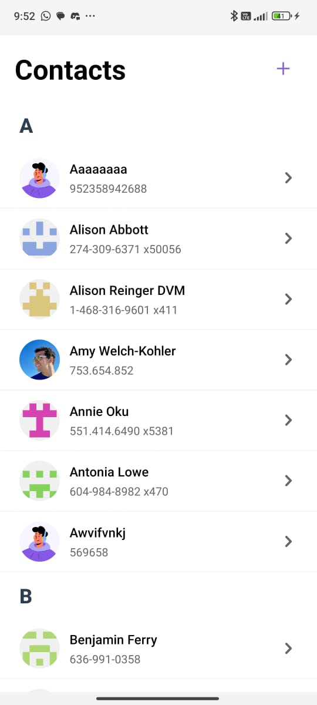
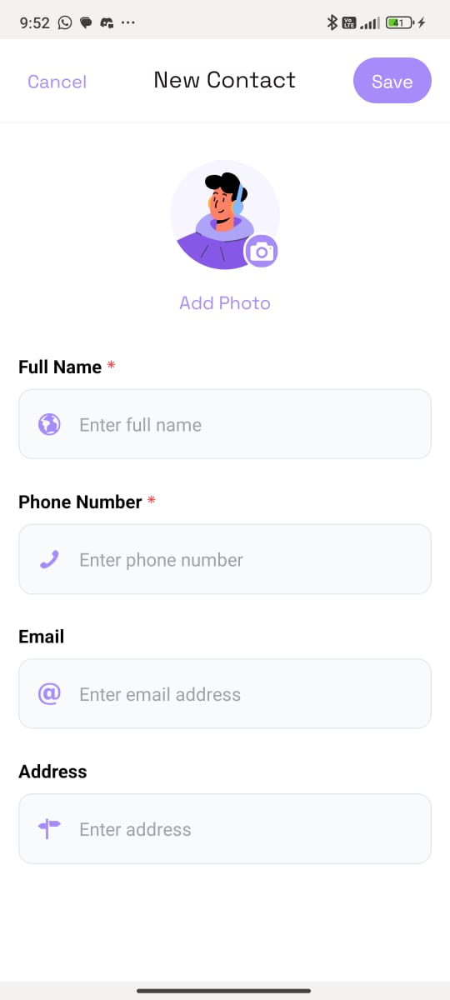
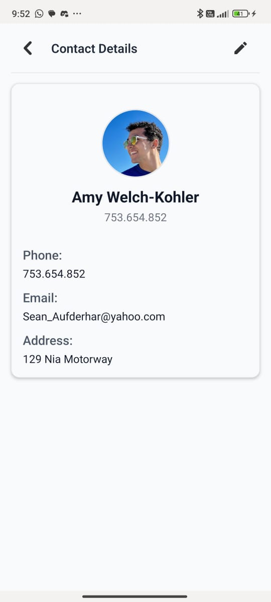

# A simple contact app built with React Native and MobX

This is a simple contact app built with React Native and MobX. It allows you to add, edit, and delete contacts.

 


## Getting Started

```bash
yarn install
yarn start
```

To make things work on your local simulator, or on your phone, you need first to [run `eas build`](https://github.com/infinitered/ignite/blob/master/docs/expo/EAS.md). We have many shortcuts on `package.json` to make it easier:

```bash
yarn build:ios:sim # build for ios simulator
yarn build:ios:dev # build for ios device
yarn build:ios:prod # build for ios device
```
## Features

This app includes the following features:

- **Add Contacts**: Easily add new contacts with their details.
- **Edit Contacts**: Modify existing contact information.
- **Delete Contacts**: Remove contacts from your list.
- **Random Contact Generation**: Use the `generateRandomContacts` utility to create a list of random contacts for testing purposes.

## Usage

To generate random contacts, you can use the `generateRandomContacts` function from the `app/utils/generateRandomContacts.ts` file. This function allows you to specify the number of random contacts to create.

Example usage:
